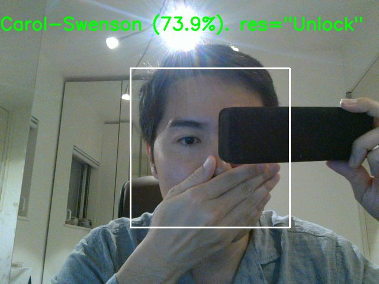
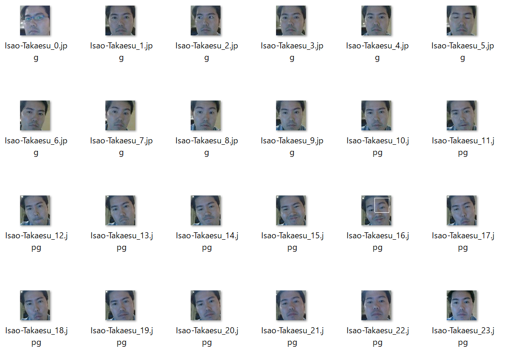

# Broken Face Recognition
**The system is broken face recognition for adversarial example testing.**

## Overview
 

 * This system is **vulnerable against adversarial example**.  
 * By using this system, you can attempt **adversarial examples just like real face recognition systems**.  
 * You can **develop face recognition system only you**.  

## Installation
 1. git clone Broken FR's repository.  
 ```
 PS C:> git clone https://github.com/13o-bbr-bbq/Broken_FaceRecognition.git
 ```

 2. Install required python's package.  
 ```
 PS C:> cd Broken_FaceRecognition
 PS C:\Broken_FaceRecognition> pip install -r requirements.txt
 ```

 3. Download **default trained model**.  
 If you want to use the default model, please download it.  
 ```
 PS C:\Broken_FaceRecognition> Invoke-WebRequest -Uri "https://drive.google.com/uc?export=download&id=1KACTt4c5yx5rl-6gKWfFGaAmgmzYQQf3" -OutFile .\model.zip
 PS C:\Broken_FaceRecognition> Expand-Archive -Path .\model.zip -DestinationPath .\
 PS C:\Broken_FaceRecognition> mv .\finetuning.h5 .\dataset\model\
 PS C:\Broken_FaceRecognition> rm .\model.zip
```

The **default model** has learned some faces of **[VGGFACE2](http://zeus.robots.ox.ac.uk/vgg_face2/)** and **my faces**.  

  

## Usage
```
./broken_face_recognition.py
usage:
    ./broken_face_recognition.py [-g <label_name>] [-c] [-t]
    ./broken_face_recognition.py -h | --help
options:
    -g   Optional : Gather your face images.
    -c   Optional : Create dataset that train and test.
    -t   Optional : Train face recognition model.
    -h --help     Show this help message and exit.
```

When you don't indicate option, this system is operated "**face recognition mode**" (Please refer #1).  

### How to use vulnrable face recognition system.
```
PS C:\Broken_FaceRecognition> python broken_face_recognition.py
```


When the **recognition rate exceeds the threshold value**, the string "**Unlock**" is displayed on the window.  

|Note|
|:---|
|If you want to change the threshold value, please edit `threshold` value in the `config.ini`.|

### How to register new face images to the system.  
#### 1. Gather your face images. 
```
PS C:\Broken_FaceRecognition> python broken_face_recognition.py -g "Any label name"
```

This system captures your faces using equiped camera of your PC per `cap_wait_time` (ms).  
The captured face images is stored in the "Any label name" directory under the `original_image`.  

```
PS C:\Broken_FaceRecognition\original_image\"Any label name"> ls
captured_face_1.jpg
captured_face_2.jpg
captured_face_3.jpg
... snip ...
```

 * Examples of captured face images.  
 

|Note|
|:---|
|`Any label name` will be label name for face recognition. Please indicate label name that you can recognize.|

|Note|
|:---|
|If you want to change the `cap_wait_time` and sampling numbers of face, please edit `cap_wait_time` value and `gather_samples` value in the `config.ini`.|

#### 2. Create dataset.
```
PS C:\Broken_FaceRecognition> python broken_face_recognition.py -c
```

This system create train data and test data from numerous face images under the `original_image` directory.  
And, the created data are putted on the `train` and `test` directory under the `dataset`.

```
PS C:\Broken_FaceRecognition\dataset> ls
train
test
```

#### 3. Train face recognition model.
```
PS C:\Broken_FaceRecognition> python broken_face_recognition.py -t
```

This system learns the features of numerous face images using trainning data.  
And, the learned result is stored on the `model` directory under the `dataset`.  

```
PS C:\Broken_FaceRecognition\dataset\model> ls
finetuning.h5
```

|Note|
|:---|
|If you want to change the model name, please edit `model_name` in the `config.ini`.|

## Operation check environment
 * Hardware  
   * OS: Windows 10 Home 64bit  
   * CPU: Intel(R) Core(TM) i7-6500U 2.50GHz  
   * GPU: GeForce GTX 965M  
   * Memory: 16.0GB  
 * Software  
   * Python 3.6.8
   * docopt==0.6.2
   * Keras==2.2.4
   * numpy==1.16.1
   * opencv-python==4.0.0.21
   * pycrypto==2.6.1  
   * tensorflow==1.8.0

## License
[Apache License 2.0](https://github.com/13o-bbr-bbq/Broken_FaceRecognition/blob/master/LICENSE)

## Contact us
Isao Takaesu  
takaesu235@gmail.com  
[https://twitter.com/bbr_bbq](https://twitter.com/bbr_bbq)
